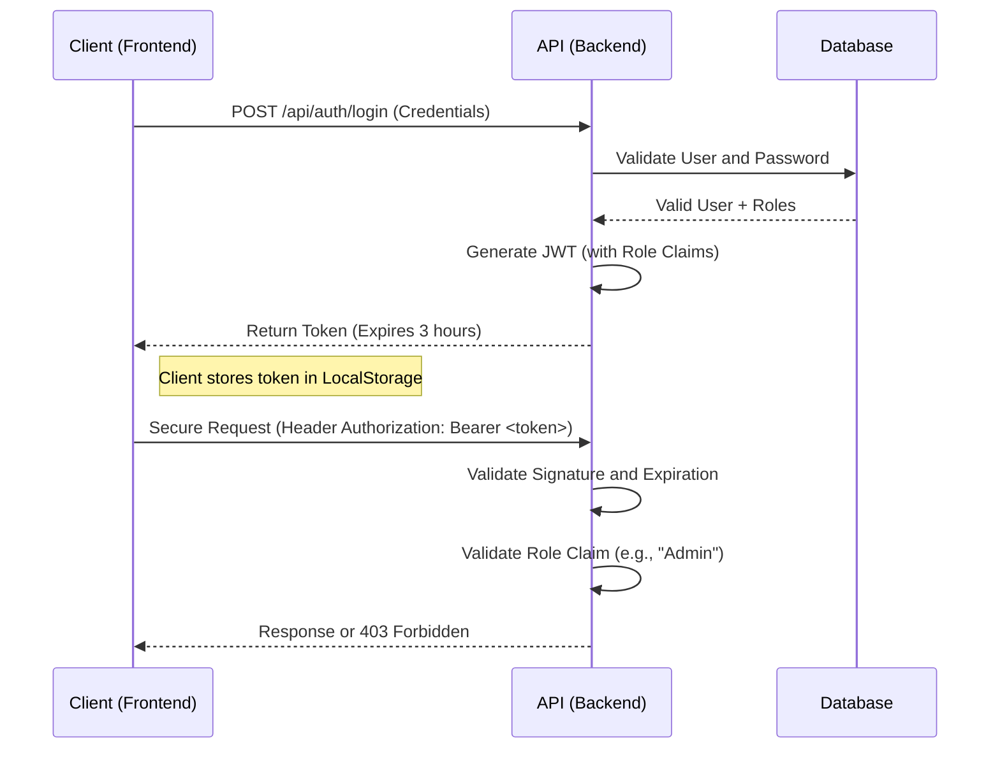

# Course Platform - Technical Assessment

**Author**: Abrahan Taborda Echavarria  
**Role**: Riwi Coder  
**Year**: 2026

## 📋 Description
Course and lesson management platform developed with .NET 9 (Backend) and React 18 (Frontend).
Key Features:
- Complete Course and Lesson Management (CRUD).
- Rich Content for Lessons (Text/HTML).
- Role-Based Access Control (Admin, Instructor, Student).
- Immersive Learning Mode for Students.

## 🛠️ Database Configuration Steps

The project uses **PostgreSQL** running in Docker.

1. Ensure **Docker** and **Docker Compose** are installed.
2. Navigate to the project root.
3. Run the database container:
   ```bash
   # This will start PostgreSQL on port 5433
   docker-compose up -d
   ```
   *Note: Port 5433 is used to avoid conflicts with local installations.*

## ⚙️ Migration Commands

The application is configured to apply migrations automatically on startup. However, if you need to apply them manually or create new ones:

1. Install the EF Core tool (if not installed):
   ```bash
   dotnet tool install --global dotnet-ef
   ```
2. Run the migration from the root:
   ```bash
   dotnet ef database update --project src/CoursePlatform.Infrastructure --startup-project src/CoursePlatform.API
   ```

## 🚀 How to Run the API and Frontend

### Backend (API)
```bash
dotnet run --project src/CoursePlatform.API/CoursePlatform.API.csproj
```
- API will be available at: `http://localhost:5113`
- Swagger UI: `http://localhost:5113/swagger`

### Frontend (React)
Open a new terminal:
```bash
cd frontend
npm install
npm run dev
```
- Web app will be available at: `http://localhost:5173`

## 🧪 Running Tests

The project includes a unit test suite covering the main business rules.

```bash
dotnet test
```
**Expected Result**: 10 tests passed, 0 failed.

## 🔑 Credentials and Roles

The system automatically initializes these users for testing:

| Role | Email | Password | Permissions |
|-----|-------|------------|----------|
| **Admin** | `admin@test.com` | `Password123!` | Create, Edit, Delete, Publish Courses. |
| **Student** | `student@test.com` | `User123!` | Only view courses and lessons. |

> **Note**: Any new user registered from the frontend will have the **Student** role by default.

---

## 📚 API Documentation (Swagger)

Although the API has Swagger UI at `/swagger`, here are the main schemas and examples.

### 🔐 Authentication

**POST** `/api/auth/login`
- **Request**:
  ```json
  {
    "email": "admin@test.com",
    "password": "Password123!"
  }
  ```
- **Response**:
  ```json
  {
    "token": "eyJhbGciOiJIUz...",
    "expiration": "2026-01-05T20:00:00"
  }
  ```

### 🎓 Courses

**POST** `/api/courses` (Admin/Instructor)
- **Request**:
  ```json
  {
    "title": "Advanced .NET 9 Course"
  }
  ```

**GET** `/api/courses/search?status=Published`
- **Response**:
  ```json
  [
    {
      "id": "3fa85f64-5717-4562-b3fc-2c963f66afa6",
      "title": "Advanced .NET 9 Course",
      "status": "Published",
      "totalActiveLessons": 5,
      "lastModified": "2026-01-05T12:00:00Z",
      "authorId": "user-guid-123"
    }
  ]
  ```

**PATCH** `/api/courses/{id}/publish`
- **Rule**: Can only publish if it has at least one active lesson.
- **Errors**:
  - `400 Bad Request`: "Cannot publish a course with no active lessons."

### 📝 Lessons

**POST** `/api/lessons`
- **Request**:
  ```json
  {
    "courseId": "3fa85f64-5717-4562-b3fc-2c963f66afa6",
    "title": "Introduction to Clean Architecture",
    "content": "<h1>Welcome</h1><p>In this lesson we will learn...</p>"
  }
  ```

---

## 🔒 Security Architecture

The system implements a robust security scheme based on **JWT (JSON Web Tokens)** and **RBAC (Role-Based Access Control)** with Identity.

### Authentication Flow


### Granular Permission Control (RBAC)
Security is not just binary (logged in/not logged in), but granular policies are applied using `[Authorize(Roles = "...")]`:

| Resource | Action | Required Permission | Code Implementation |
|---------|--------|-------------------|-----------------------|
| **Courses** | Create/Edit/Delete | **Admin** or **Instructor** | `[Authorize(Roles = "Admin,Instructor")]` |
| **Courses** | Publish/Unpublish | **Admin** or **Instructor** | Business logic validates authorship / Admin |
| **Courses** | View (Search/Get) | **Any Auth** | `[Authorize]` (Student included) |
| **Users** | Register | **Public** | Assigns `Student` role by default |

### Token Expiration and Security
- **Expiration**: Configured to **3 hours** to balance security and UX.
- **Claims**: The token includes `ClaimTypes.Role` for instant validation in the backend without querying the DB on every request.
- **Revocation**: Being stateless JWT, revocation is handled by expiration (or blacklisting in advanced implementations).

---
*Project submitted for the Riwi technical assessment.*
