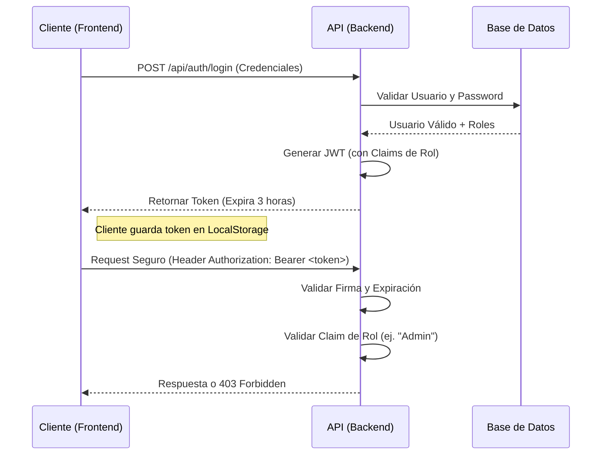

# Plataforma de Cursos - Prueba Técnica

**Autor**: Abrahan Taborda Echavarria  
**Rol**: Coder de Riwi  
**Año**: 2026

## 📋 Descripción
Plataforma de gestión de cursos y lecciones desarrollada con .NET 9 (Backend) y React 18 (Frontend).
Características principales:
- Gestión completa de Cursos y Lecciones (CRUD).
- Contenido enriquecido para lecciones (Texto/HTML).
- Control de acceso por roles (Admin, Instructor, Student).
- Modo de aprendizaje inmersivo para estudiantes.

## 🛠️ Pasos para configurar la base de datos

El proyecto utiliza **PostgreSQL** montado en Docker.

1. Asegúrate de tener **Docker** y **Docker Compose** instalados.
2. Navega a la raíz del proyecto.
3. Ejecuta el contenedor de base de datos:
   ```bash
   # Esto levantará PostgreSQL en el puerto 5433
   docker-compose up -d
   ```
   *Nota: Se usa el puerto 5433 para evitar conflictos con instalaciones locales.*

## ⚙️ Comandos para ejecutar migraciones

La aplicación está configurada para aplicar migraciones automáticamente al iniciar. Sin embargo, si necesitas aplicarlas manualmente o crear nuevas:

1. Instala la herramienta de EF Core (si no la tienes):
   ```bash
   dotnet tool install --global dotnet-ef
   ```
2. Ejecuta la migración desde la raíz:
   ```bash
   dotnet ef database update --project src/CoursePlatform.Infrastructure --startup-project src/CoursePlatform.API
   ```

## 🚀 Cómo levantar la API y el frontend

### Backend (API)
```bash
dotnet run --project src/CoursePlatform.API/CoursePlatform.API.csproj
```
- La API estará disponible en: `http://localhost:5113`
- Swagger UI: `http://localhost:5113/swagger`

### Frontend (React)
Abre una nueva terminal:
```bash
cd frontend
npm install
npm run dev
```
- La web estará disponible en: `http://localhost:5173`

## 🧪 Ejecutar Tests

El proyecto incluye una suite de pruebas unitarias que cubren las reglas de negocio principales.

```bash
dotnet test
```
**Resultado esperado**: 10 tests pasados, 0 fallidos.

## 🔑 Credenciales y Roles

El sistema inicializa automáticamente estos usuarios para pruebas:

| Rol | Email | Contraseña | Permisos |
|-----|-------|------------|----------|
| **Admin** | `admin@test.com` | `Password123!` | Crear, Editar, Eliminar, Publicar Cursos. |
| **Student** | `student@test.com` | `User123!` | Solo ver cursos y lecciones. |

> **Nota**: Cualquier usuario nuevo que se registre desde el frontend tendrá el rol de **Student** por defecto.

---

## 📚 Documentación de API (Swagger)

Aunque la API cuenta con Swagger UI en `/swagger`, aquí se detallan los esquemas y ejemplos principales.

### 🔐 Autenticación

**POST** `/api/auth/login`
- **Request**:
  ```json
  {
    "email": "admin@test.com",
    "password": "Password123!"
  }
  ```
- **Response**:
  ```json
  {
    "token": "eyJhbGciOiJIUz...",
    "expiration": "2026-01-05T20:00:00"
  }
  ```

### 🎓 Cursos

**POST** `/api/courses` (Admin/Instructor)
- **Request**:
  ```json
  {
    "title": "Curso Avanzado de .NET 9"
  }
  ```

**GET** `/api/courses/search?status=Published`
- **Response**:
  ```json
  [
    {
      "id": "3fa85f64-5717-4562-b3fc-2c963f66afa6",
      "title": "Curso Avanzado de .NET 9",
      "status": "Published",
      "totalActiveLessons": 5,
      "lastModified": "2026-01-05T12:00:00Z",
      "authorId": "user-guid-123"
    }
  ]
  ```

**PATCH** `/api/courses/{id}/publish`
- **Regla**: Solo se puede publicar si tiene al menos una lección activa.
- **Errores**:
  - `400 Bad Request`: "Cannot publish a course with no active lessons."

### 📝 Lecciones

**POST** `/api/lessons`
- **Request**:
  ```json
  {
    "courseId": "3fa85f64-5717-4562-b3fc-2c963f66afa6",
    "title": "Introducción a Clean Architecture",
    "content": "<h1>Bienvenido</h1><p>En esta lección aprenderemos...</p>"
  }
  ```

---

## 🔒 Arquitectura de Seguridad

El sistema implementa un esquema de seguridad robusto basado en **JWT (JSON Web Tokens)** y **RBAC (Role-Based Access Control)** con Identity.

### Flujo de Autenticación


### Control Granular de Permisos (RBAC)
La seguridad no es solo binaria (logueado/no logueado), sino que se aplican políticas granulares mediante `[Authorize(Roles = "...")]`:

| Recurso | Acción | Permiso Requerido | Implementación Código |
|---------|--------|-------------------|-----------------------|
| **Cursos** | Crear/Editar/Borrar | **Admin** o **Instructor** | `[Authorize(Roles = "Admin,Instructor")]` |
| **Cursos** | Publicar/Despublicar | **Admin** o **Instructor** | Logica de negocio valida autoría / Admin |
| **Cursos** | Ver (Search/Get) | **Cualquier Auth** | `[Authorize]` (Student incluido) |
| **Usuarios** | Registrarse | **Público** | Asigna rol `Student` por defecto |

### Expiración y Seguridad del Token
- **Expiración**: Configurada a **3 horas** para balancear seguridad y UX.
- **Claims**: El token incluye `ClaimTypes.Role` para validación instantánea en el backend sin consultar la BD en cada request.
- **Revocación**: Al ser JWT stateless, la revocación se maneja por expiración (o lista negra en implementaciones avanzadas).

---
*Proyecto entregado para la evaluación técnica de Riwi.*
